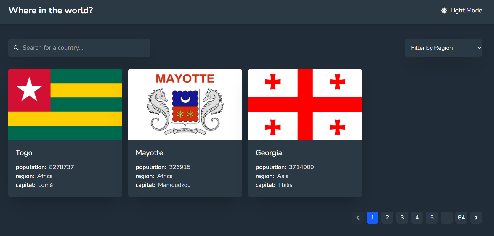
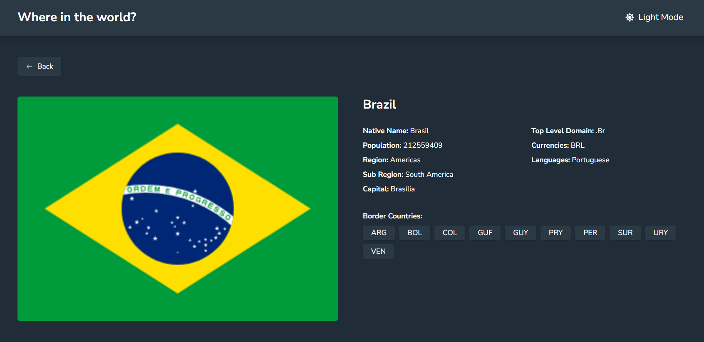

# 🌍 Country Explorer

A simple and responsive country explorer built with React.js, featuring region-based filtering, search functionality, and pagination for seamless navigation.

### 🌐 Live Demo: [Country Explorer](https://country-guide-mz.vercel.app)

## 📸 Preview

### Home Page

### Country Details

## 🧠 Key Concepts

- `@theme` for implementing light and dark mode using CSS variables
- Dynamic filtering by country name and region using the [REST Countries API](https://restcountries.com)
- `useDebounce` – A custom hook that delays updating a value until a specified delay has passed, used to optimize search input and prevent excessive API calls
- `usePagination` – A reusable custom hook for handling client-side pagination logic

## ⚠️ Limitations

- **Client-Side Pagination:** All country data is loaded at once; for large datasets, server-side pagination would be more efficient
